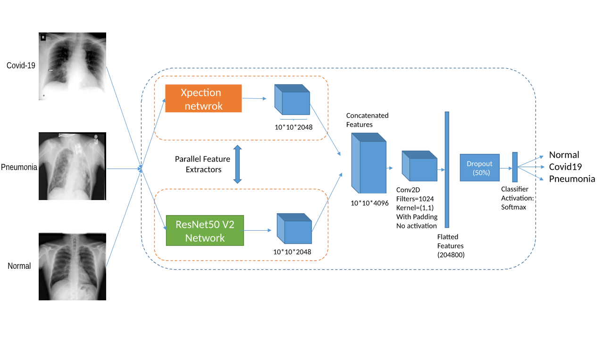

# A New Modified Deep Convolutional Neural Network for detecting COVID-19 from X-ray images

COVID-19 has become a serious health problem all around the world.  It is confirmed that this virus has taken over 126,607 lives until today. Since the beginning of its spreading, many Artificial Intelligence researchers developed systems and methods for predicting the virus's behavior or detecting the infection. One of the possible ways of determining the patient infection to COVID-19 is through analyzing the chest X-ray images. As there are a large number of patients in hospitals, it would be time-consuming and difficult to examine lots of X-ray images, so it can be very useful to develop an AI network that does this job automatically.  In this paper, we have trained several deep convolutional networks with the introduced training techniques for classifying X-ray images into three classes: normal, pneumonia, and COVID-19, based on two open-source datasets. Unfortunately, most of the previous works on this subject have not shared their dataset, and we had to deal with few data on covid19 cases. Our data contains 180 X-ray images that belong to persons infected to COVID-19, so we tried to apply methods to achieve the best possible results. In this research, we introduce some training techniques that help the network learn better when we have few cases of COVID-19, and also we propose a neural network that is a concatenation of Xception and ResNet50V2 networks. This network achieved the best accuracy by utilizing multiple features extracted by two robust networks. In this paper, despite some other researches, we have tested our network on 11302 images to report the actual accuracy our network can achieve in real circumstances. The average accuracy of the proposed network for detecting COVID-19 cases is 99.56%, and the overall average accuracy for all classes is 91.4%.

The two open-source datasets are available on:

1- https://github.com/ieee8023/covid-chestxray-dataset

2-https://www.kaggle.com/c/rsna-pneumonia-detection-challenge 

The first dataset contains COVID-19 and some other diseases like ARDS, SARS, Streptococcus, Pneumocystis.

The second dataset contains patients with pneumonia and normal people.

Some of the images of these datasets are:

  

 *These images show Normal, Pneumonia and COVID-19 cases from left to right respectively.*

We have used a concatenation of ResNet50V2 and Xception networks as the network for classifying the images into 
three classes: Normal, Pneumonia, and COVID-19.

	
	 
	<em>The architecture of our proposed network</em>

We have evaluated our network on 11302 images to show the real performance of our proposed network.

The confusion matrixes for two folds are depicted below:

 The next tables will show the average of specificity and recall metrics for each class between five folds.
 
 Metric | COVID-19 | Pneumonia | Normal
------------ | ------------- | ------------- | -------------
Specificity | 99.56 | 94.32 | 88.09
Accuracy | 99.50 | 91.60 | 91.71

You can access my written codes here as follows:

In the data Loading-Training-Evaluating.ipynb file, you can find our codes for loading data, network training, and evaluation.

The dataset preparing.ipynb file contains codes that were used for preparing the dataset, and some part of this code is inspired by Linda Wang and Alexander Wong work that is shared on https://github.com/lindawangg/COVID-Net/blob/master/README.md.

Results.py includes the codes that are written to outputs the confusion matrixes and details for the tables.

You can also access and use all of our trained networks for each fold in :
https://drive.google.com/drive/folders/19R4T-D-bWUkQOh3xy5CkIDAmkLBt8ID7?usp=sharing

In the results folder, you can access all the details of our achieved results. The Confusion_matrix folder is included the confusion matrixes of all the networks we tested for each fold, and in the prepared_csv_files directory, we have shared all the CSV files we generated and used in our work.
